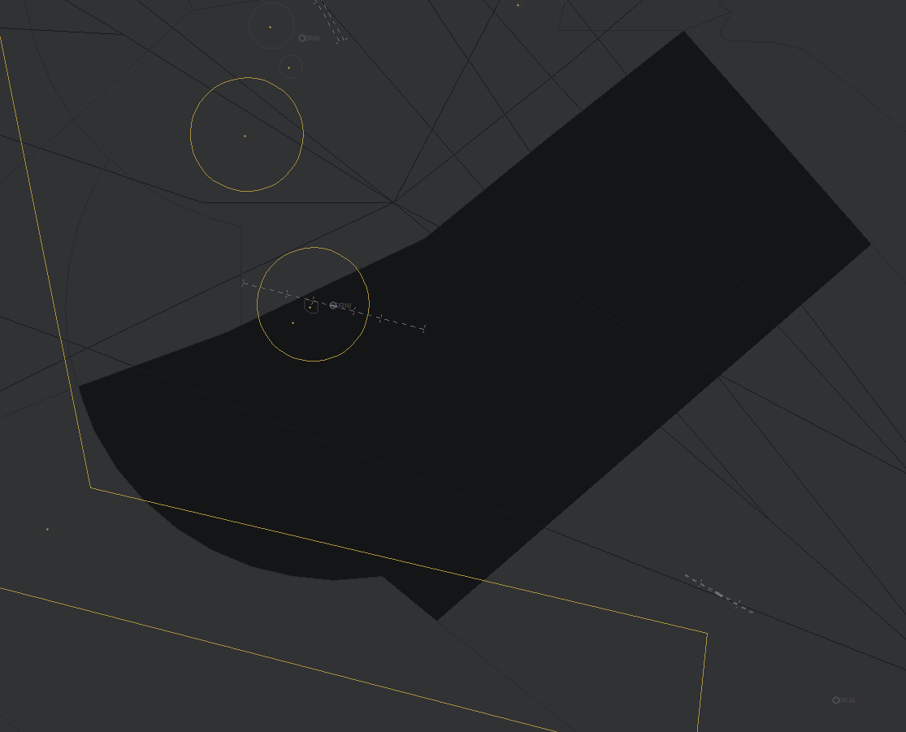

# 3. Al Najaf Intl Airport (ORNI)
## 3.1. Particulars

### 3.1.1. Aerodrome Description
Al Najaf International Airport is a popular international airport in Iraq, serving as a hub for Iraqi Airways and operating multiple flights, both domestic and internationally. Notably, Al Najaf is the only airport in Iraq to implement and use published SID and STAR procedures for some departures and arrivals.

### 3.1.2. Aerodrome Geographical Data

| **Data**              | **Value**             |
|-----------------------|------------------------|
| ARP Coordinates       | N33°59.3' E44°24.3'    |
| Elevation at ARP      | 107 feet               |
| Magnetic Variation    | 4° East                |

### 3.1.3. Radio Navigation & Landing Aids

| **Type**     | **Ident** | **Name**     | **Frequency** | **Remarks**     |
|--------------|-----------|--------------|---------------|-----------------|
| VOR/DME      | ALI       | AL-ASHRAF    | 114.700 MHz   | —               |
| ILS DME/LOC  | IALI      | —            | 108.3 MHz     | ILS CAT II (RWY 10) |
| ILS DME/LOC  | INJF      | —            | 109.9 MHz     | ILS CAT I (RWY 28) |
| NDB          | ALI       | AL-ASHRAF    | 275.000 KHz   | —               |

### 3.1.4. Runways

| **Runway** | **Runway Dimension** | **MAG BRG**   | **Threshold Elevation** |
|------------|----------------------|---------------|--------------------------|
| 10         | 3000 x 45 m          | 100°          | 116 feet                |
| 28         | 3000 x 45 m          | 280°          | 92 feet                 |

## 3.2. General Aerodrome procedures

### 3.2.1. Preferential
The preferential landing runways at Al Najaf are Runway 28 for landings and Runway 10 for departures. This preferential runway configuration applies opposite runway direction operations. This may not always be possible either due to weather conditions (specifically when there is a tailwind component greater than 5 knots) or due to volumes of high traffic, which make opposite direction operations unsuitable. The operating air traffic control officer shall use their discretion and take the above factors into account when deciding and implementing active runways for arrivals and departures.

### 3.2.2. SMC & Delivery Procedures
The SMC controller’s callsigns for radio communication and coordination, is Al Najaf Ground. The SMC controller is responsible for operations on the surface of Al Najaf International Airport - including pushback/engine startup, repositioning, taxi; and issuing airway clearances prior to flight.

#### 3.2.2.1. IFR Clearance
Al Najaf is the only Iraqi airport that utilises published Standard Instrument Departures (SIDs) and Standard Arrival Routes (STARs). Standard departures shall follow SIDs and shall file the following waypoints as their first waypoint and shall be cleared on the appropriate connecting published SID on their flight planned route via the following waypoints:

* ILMAP (South)
* LAGLO (North)
* NOLDO (East)
* SEPTU (North)
* SIGBI (West)

Exceptions are made for departures to the southwest, filing via “RUKAM” (or ALI DCT RUKAM). These aircraft, in addition to aircraft that are unable to accept a SID from Al Najaf, shall be told to expect radar vectors after departure to their first waypoint and flight planned route.

IFR clearances shall be issued prior to any other instructions and should follow the following format. Each of the following items must be read back by the pilot receiving the clearance.

* Callsign;
* Clearance limit (normally the flight’s destination)
* Flight route - including their SID, then “flight planned route”;
* SSR code.

Clearance Example.

!!! example
    **Controller**: “IRAQI ONE FIFE SEVEN, cleared to Kuwait via ILMAP1A departure, flight planned route. Squawk One Tree Seven Two”

If the pilot does not report the current ATIS letter on first contact, the ground controller shall inform the pilot of the current ATIS letter.

#### 3.2.2.2. Initial climb altitudes
The initial climb clearance is stated on published SID charts and does not need to be read to the pilot by default. Nevertheless, if the pilot asks for the initial climb altitude, the controller shall advise them of the following initial climb clearances:

### Standard Instrument Departures (SIDs)

| **SID**     | **Runway** | **Initial Climb Clearance** |
|-------------|------------|-----------------------------|
| SIGBI 1A    | 10         | 6,000 ft                    |
| ILMAP 1B    | 28         | 6,000 ft                    |
| LAGLO 1A    | 10         |                             |
| NOLDO 1A    | 10         |                             |
| SEPTU 1A    | 10         |                             |
| NOLDO 1C    | 10         | 11,000ft                    |
| ILMAP 1A    | 10         | 14,000ft                    |
| LAGLO 1B    | 28         | 14,000ft                    |
| NOLDO 1B    | 28         | 14,000ft                    |
| SEPTU 1B    | 28         | 14,000ft                    |
| SIGBI 1B    | 28         | 14,000ft                    |

### 3.2.3. ADC Procedures
The ADC controller’s callsigns for radio communication and coordination, is Al Najaf Tower. The ADC controller is responsible for operations on the only runway of Al Najaf International Airport, as well as the surrounding air control zone, which extends from the ground up to 4,000ft, in addition to the responsibilities of Al Najaf Ground, if offline.

#### 3.2.3.1. Coordination with overlying radar control
All SIDs except for the ILMAP departure follow a path where they enter Baghdad TMA (controlled by ORBI_APP) during their departure phase. As such, the ADC controller must coordinate with ORBI_APP (or the relevant overlying radar controller) for a release for departure for every aircraft departing on these SIDs, in addition to aircraft carrying out the omni-directional departure, that are expected to enter the Baghdad TMA (mainly departures to the North). ORNI_APP shall be notified of this release by ORNI_TWR. Aircraft departing via ILMAP shall get a release for departure from ORNI_APP.

For aircraft that are not following a published SID, the ADC controller shall coordinate with the overlying radar controller on initial climb and heading to follow after departure, prior to issuing a takeoff clearance. The runway heading (100°/280°) shall be avoided when possible.

#### 3.2.3.2. “Holy Shrine” prohibited airspace”
Special consideration must be given to a prohibited area west of the airport, when runway 28 is in use for departures. This prohibited area protects the “Holy Shrine” and flights shall, when possible and when not following SIDs, avoid the area by flying north of the Holy Shrine. Therefore, it is recommended that a heading clockwise to 280° is given for aircraft departing runway 28. VFR flights shall also be guided to avoid this area when possible.

## 3.3. TMA Procedures
The TMA position (ORNI_APP) which covers the TMA overhead Al Najaf airport is part of the “Ali TMA”. As with all approach positions, its radio-telephony callsign is “Baghdad Approach''. Importantly, when ORNI_APP is offline. The TMA and the underlying Al Najaf airport is controlled by ORMM_APP when online. Due to its close proximity to Baghdad TMA, the position covers an area shaped in a semi-circle south of Al-Najaf airport with a radius of approximately 60nm, in addition to an extended part of the TMA to the east of Al Najaf. The position extends from 1,500ft to FL235 and is mainly responsible for traffic arriving and departing Al Najaf, as well as overflying aircraft below FL235.

<figure markdown="span">
  { width=500}
  <figcaption>Airspace controlled by “ORNI_APP” on VATSIM.</figcaption>
</figure>

### 3.3.1. IFR Arrivals
Arrivals into Al Najaf may follow published RNAV standard arrival routes (STARs). These published STARs have various altitude restrictions, but generally terminate at Initial Approach Fixes (IAFs) that connect to the ILS. As such, pilots may remain on RNAV STARs without being vectored off, then cleared for an ILS, Localiser or RNP approach from the appropriate IAF. As usual, aircraft that are unable to follow RNAV arrivals or are having difficulties may be vectored for an approach. They may also be vectored for sequencing, or if it is more efficient to vector (e.g. for a shortcut).

### 3.3.2. Coordination with ORBI_APP
In connection to point 5.2.3.1 regarding releases for departure, especially for departures that will enter Baghdad TMA, ORNI_APP shall either transfer the departure in question to ORBI_APP in due time before they enter Baghdad TMA. Alternatively, ORNI_APP may coordinate with ORBI_APP on keeping the aircraft on their frequency before transferring them to the next relevant controller (e.g. Baghdad Control). Appropriate coordination with ORBI_APP is also crucial for arrivals following the EGPEN and LOVOK arrivals from the north.