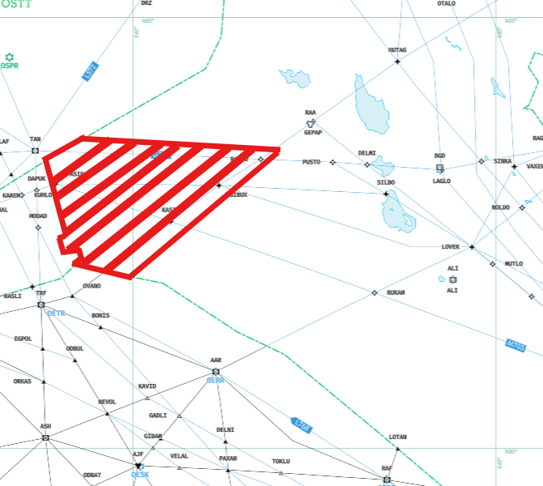
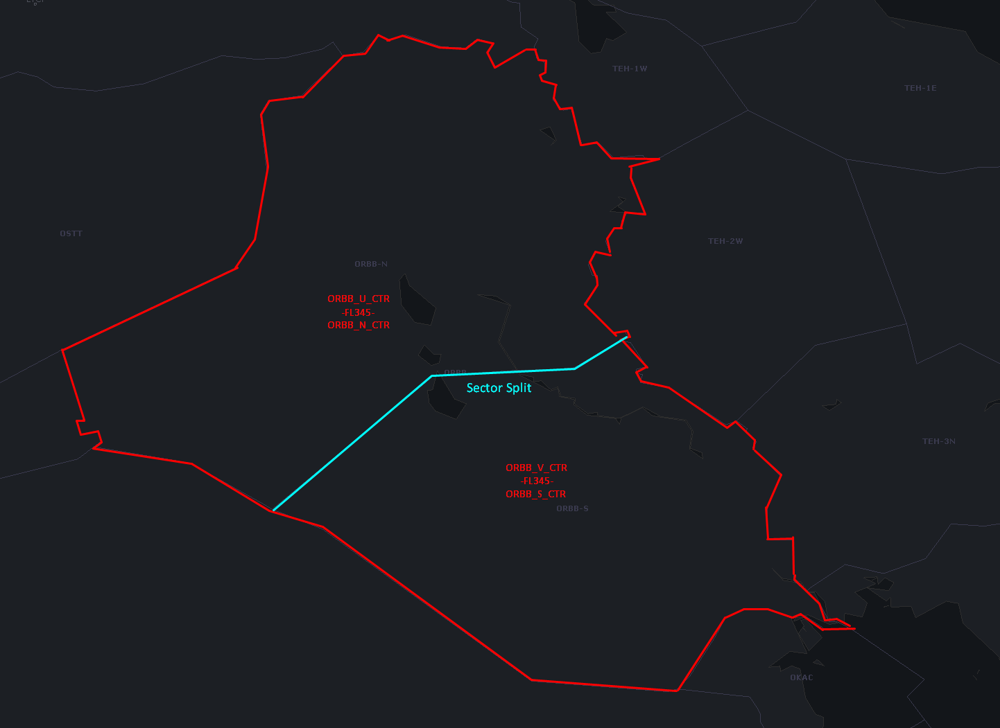

# 2. Baghdad Control (ORBB_N_CTR)
## 2.1. General Airspace Overview
Baghdad Control covers the whole Baghdad FIR and its underlying TMA and CTR positions when these are offline, on a top-down basis. When other ORBB_CTR sectors are offline, the default bandbox position is “ORBB_N_CTR” on 132.875MHz. The airspace is notorious for its overflights between Europe and the Middle East along its North-South ATS routes and these are often saturated with traffic. These airways are structured in a way where they avoid each other in regards to crossing airways, as well as to avoid getting close to Iranian airspace. Issuing route-directs within Baghdad FIR, either for shortcutting or for separation purposes is permitted. However, the air traffic control officer must be aware of both crossing traffic and Iranian airspace and must guarantee that flights avoid both when issuing route-directs. Route-directs are not permitted outside of Baghdad FIR airspace without prior coordination with the next sector.

## 2.2. Non-Radar Airspace

### 2.2.1. Airspace Definition
A part of the FIR on its western side is procedural enroute due to lack of radar coverage. The following airways are located within non-radar procedural enroute airspace.

* G202 between RAPLU and MODIK
* L200 between GIBUX and PASIP
* R652 between DAXAN and GIBUX

The AIP does not list any other airways that are located in non-radar airspace, however it logically makes sense if airway M703 is also located within non-radar airspace, between points ANBAR and PASIP. The following image approximately highlights airspace that is not covered by radar.

{width=500}

### 2.2.2. Position reports
Aircraft operating in non-radar airspace cannot be seen on radar and must give position reports after crossing each waypoint in non-radar airspace. A position report should include the following information:

* Waypoint crossed
* Time at which the waypoint was crossed
* Flight level at crossing
* Inbound waypoint
* ETA for inbound waypoint
* Next waypoint thereafter

## 2.3. Separation Minima

### 2.3.1. Separation Minima in radar airspace
The minimum horizontal radar separation for IFR aircraft in class A airspace and class E airspace for flights along airways is 5 nautical miles. This only applies in radar-controlled airspace. The vertical separation in all Baghdad airspace is the standard 1,000ft below FL410 and 2,000ft above FL410. Aircraft flying on the same airway/in the same direction and on the same level shall be horizontally separated by 5 nautical miles, provided they are assigned speed restrictions which result in their horizontal separation gradually increasing.

### 2.3.2. Sequencing in radar airspace
Aircraft that are following each other with the same destination that is in or in the vicinity of the Baghdad FIR shall be sequenced behind one another in order to reduce the risk of conflict during their descent and approach phase. Generally, the miles-in-trail between sequenced aircraft shall be 10 nautical miles (10nm) - however, the air traffic control officer shall coordinate with and ask the next adjacent sector in order to best assist the next controllers with sequencing and arriving aircraft.

### 2.3.3. Separation Minima in non-radar airspace
Due to the lack of radar in non-radar procedural airspace, it is not possible to use distance-based separation. Therefore, position reports are used to determine the time of waypoint crossing. Time-based separation is therefore used in order to separate traffic flying on the same flight level in non-radar airspace. Due to the higher risk of conflict within procedural airspace, no level change (climbs or descents) are permitted within non-radar airspace, so aircraft must maintain the same altitude for the entire duration of non-radar airspace crossing.

## 2.4. Arrival descent procedures
Baghdad Control shall give an initial descent instruction to FL240 for arrivals landing in Iraqi airspace, as the upper boundary of all TMA (Approach) airspace is FL235. Except for arrivals landing ORNI and ORSU, all aircraft are given radar-vectors to their approach. With this in mind, Baghdad Control shall closely coordinate with Baghdad Approach to make sure aircraft are cleared on proper routings/vectors when descending towards their destination.

Aircraft arriving at Kuwait (OKKK) shall be given a descent restriction of FL170 to be levelled by SIDAD, the FIR boundary between Baghdad and Kuwait. Aircraft arriving at Bahrain (OBBI) shall be given a descent restriction of FL310 or FL330 to be levelled by SIDAD.

## 2.5. MOA
There are 6 MOAs within ORBB FIR below is a table of entry/exit requirements, the FL’s and the correct ATS unit who need to be contacted.

| **Area**   | **Coordinates** | **Altitude Limits**     | **ATC Contact**     | **Notes**                                 |
|------------|------------------|--------------------------|----------------------|-------------------------------------------|
| **CIDER**  | 3352N 04521E – 3315N 04546E – 3306N 04524E – 3343N 04502E – 3352N 04521E | GND – 14,000 FT AMSL | Baghdad Control     | Contact ATC at least 5 minutes before entry |
| **DIJLAH** | 325159N 0461808E – 322028N 0465552E – 320519N 0463421E – 324058N 0460230E – 325159N 0461808E | SFC – FL210           | Baghdad Approach     | Contact ATC at least 5 minutes before entry |
| **FURAT**  | 322028N 0465552E – 314302N 0473948E – 312257N 0471317E – 320519N 0463421E – 322028N 0465552E | SFC – FL210           | Baghdad Approach     | Contact ATC at least 5 minutes before entry |
| **MADDOG** | 302941N 0450940E – 301011N 0463112E – 294040N 0462311E – 300117N 0445940E – 302941N 0450940E | FL160 – FL270         | Baghdad Control     | Contact ATC at least 5 minutes before entry |
| **MINDY**  | 3528N 04247E – 3541N 04314E – 3632N 04238E – 3618N 04206E – 3528N 04247E | FL160 – FL270         | Baghdad Control     | Contact ATC at least 5 minutes before entry |
| **PEGASUS**| 325743N 0411735E – 323850N 0422901E – 320938N 0423743E – 323845N 0405403E – 325743N 0411735E | FL160 – FL270         | Baghdad Control     | Contact ATC at least 5 minutes before entry |

## 2.6 Sector Position and Split Configurations

### 2.6.1. ORBB_N_CTR - Baghdad (Low) North - 132.875 MHz
This is the standard bandboxed Baghdad Control sector. When other sectors are offline, this position controls the whole FIR in a bandbox configuration.

### 2.6.2. ORBB_S_CTR - Baghdad (Low) South - 128.700 MHz
This is a secondary position which splits the sector into North and South and controls the southern part of the airspace, when split with Baghdad North.

### 2.6.3. ORBB_U_CTR - Baghdad High (North) - 125.900 MHz
This is a secondary position which can split with ORBB_N_CTR into High and Low sectors and controls the upper half of the FIR above FL345. This position can be combined with ORBB_S_CTR and ORBB_N_CTR. In this case, North and South are split horizontally and both control their respective airspaces below FL345 and ORBB_U_CTR controls the entire FIR above FL345.

### 2.6.4. ORBB_V_CTR - Baghdad High South - 127.100
This is a secondary position which can be used in combination with any or all of the above positions. This position always only controls the upper part of the southern sector of the FIR, so above FL345.

<figure markdown="span">
  
  <figcaption>Diagram displaying the full sector split when all four positions are online.</figcaption>
</figure>

