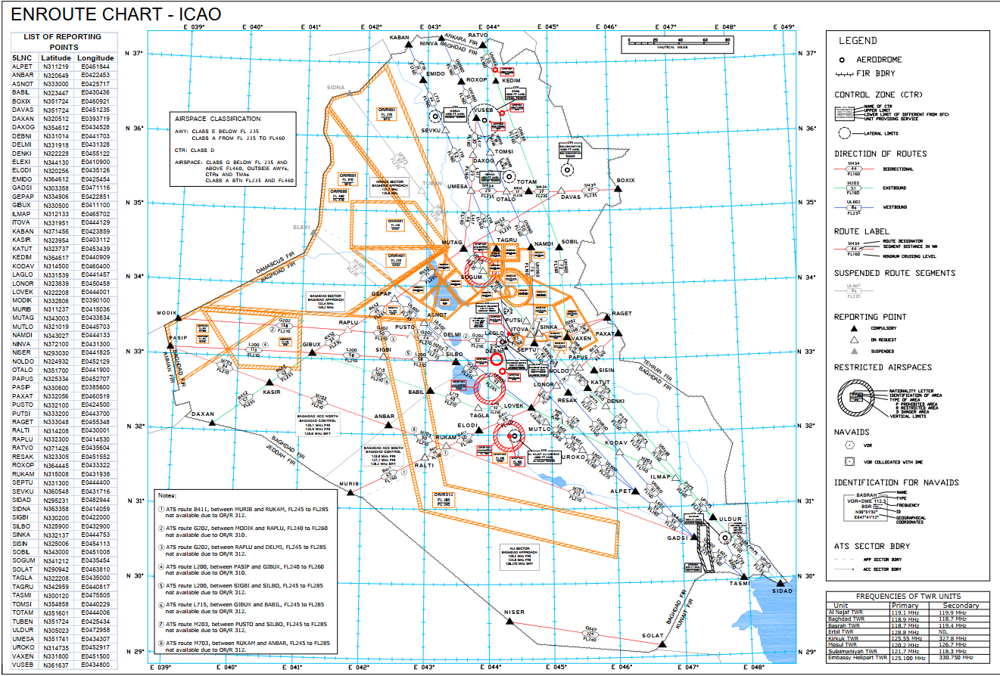
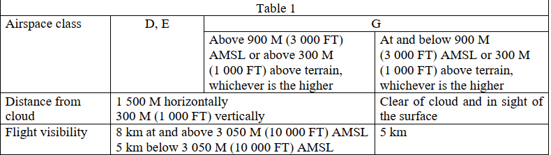

# 1. General FIR Information
## 1.1. Area description

The Baghdad FIR (ORBB) covers all of Iraqi airspace. The Iraqi AIP lists 7 airports within the FIR and 1 heliport. The Baghdad FIRs borders the following FIRs: Ankara (LTAA), Tehran (OIIX), Kuwait (OKAC), Jeddah (OEJD), Amman (OJAC) and Damascus (OSTT). The FIR has 3 TMAs (Baghdad, Kirkuk and Ali) that are controlled from 4 approach positions. The FIR is a popular enroute sector for aircraft flying between Europe and the Middle East.. A part of the FIR on its western side is procedural enroute due to lack of radar coverage. Two airports (Erbil, ORER and Sulaymaniyah, ORSU) are procedural as radar coverage is not available below 8,000ft (more information about aero-drome specific procedures is documented in section XX).

## 1.2. Air Traffic services

### 1.2.1. List of ATS callsigns
ATISes are not included in this list to avoid congestion

| Logon Callsign | Radio Callsign       | Frequency (MHz) |
|----------------|----------------------|-----------------|
| ORBI_GND       | Baghdad Ground       | 121.400         |
| ORBI_TWR       | Baghdad Tower        | 118.900         |
| ORBI_DEP       | Baghdad Departure    | 118.300         |
| ORBI_APP       | Baghdad Approach     | 122.400         |
| ORNI_GND       | Al Najaf Ground      | 121.700         |
| ORNI_TWR       | Al Najaf Tower       | 119.100         |
| ORNI_APP       | Baghdad Approach     | 124.000         |
| ORMM_GND       | Basrah Ground        | 121.700         |
| ORMM_TWR       | Basrah Tower         | 118.700         |
| ORMM_APP       | Baghdad Approach     | 120.200         |
| ORER_TWR       | Erbil Tower          | 128.800         |
| ORKK_GND       | Kirkuk Ground        | 127.375         |
| ORKK_TWR       | Kirkuk Tower         | 125.550         |
| ORKK_APP       | Baghdad Approach     | 127.700         |
| ORBM_GND       | Mosul Ground         | 126.700         |
| ORBM_TWR       | Mosul Tower          | 120.200         |
| ORSU_TWR       | Sulaimaniyah Tower   | 118.300         |
| OREZ_TWR       | Embassy Tower        | 125.100         |
| ORBB_N_CTR     | Baghdad Control      | 132.875         |
| ORBB_S_CTR     | Baghdad Control      | 123.000         |
| ORBB_U_CTR     | Baghdad Control      | 125.900         |
| ORBB_V_CTR     | Baghdad Control      | 127.100         |

### 1.2.2. ATS Airspace
This is a simplified list of airspaces. A full expanded list of sub-airspaces within TMAs is not included to avoid congestion but is available either on the Iraqi AIP or upon request from vACC staff.

| Airspace               | Primary Owner      | Class       | Boundary (ft)                    |
|------------------------|--------------------|-------------|----------------------------------|
| Baghdad CTR West       | ORBI_TWR           | D           | SFC – 3,000                      |
| Baghdad CTR East       | ORBI_TWR           | D           | 1,000 – 3,000                    |
| Najaf CTR              | ORNI_TWR           | D           | SFC – 4,000                      |
| Basrah CTR             | ORMM_TWR           | D           | SFC – 3,000                      |
| Erbil CTR              | ORER_TWR           | D           | SFC – 6,000                      |
| Kirkuk CTR             | ORKK_TWR           | D           | SFC – 4,000                      |
| Mosul CTR              | ORBM_TWR           | D           | SFC – 4,000                      |
| Sulaymaniyah CTR       | ORSU_CTR           | D           | SFC – 6,000                      |
| Embassy CTR            | OREZ_TWR           | D           | SFC – 1,100                      |
| Baghdad TMA            | ORBI_DEP/APP       | D  E        | 1,800 – FL235 (varies)  Airways           |
| Kirkuk TMA             | ORKK_APP           | D  E        | 3,000 – FL235 (varies)  Airways           |
| Ali TMA 1, 2 & 3-North | ORNI_APP           | D  E        | 1,800 – FL235 (varies)  Airways           |
| Ali TMA 3-South, 4 & 5 | ORMM_APP           | D  E        | 1,800 – FL235 (varies)  Airways           |
| Baghdad FIR            | ORBB_N_CTR (splits)| A E G| FL235 – FL460  Airways Outside of AWYs, TMAs and CTRs |

## 1.3. Transition Altitude and Level

* Transition Altitude: 14,000ft
* Transition Level: FL160 (this increases to FL170 when local QNH falls below Q980hPA)

## 1.4. Airspace Classification:
Note: Only airspace classes that are in use in Iraq are shown.

* Class A: All airspace above FL235
* Class D: All TMAs and CTRs
* Class E: Airways
* Class G: All other airspace in Baghdad FIR 9

### 1.4.1. Class A airspace
All airspace in Baghdad FIR above FL235. Only IFR flights are permitted and all flights are subject to air traffic control service and are separated from each other.

### 1.4.2. Class D airspace
All controlled TMA and CTR airspace. Both IFR and VFR flights are permitted and all are subject to air traffic control services. IFR flights are separated from other IFR flights and receive traffic information in regards to other VFR flights. VFR flights receive traffic information in regards to all other flights.

### 1.4.3. Class E airspace
Airspace established on all published ATS routes below FL235. IFR and VFR flights are permitted. IFR flights are subject to air traffic control services and are separated from other IFR flights. All flights receive traffic information as far as it is practical for ATC.

### 1.4.4. Class G airspace
AIrspace established in all areas that are not classified as classes A, D or E. IFR and VFR flights are permitted to receive flight information service if requested and when available, meaning two-way communication is not mandatory for aircraft flying in class G airspace.

## 1.5. Squawk assignments
Except for aircraft departing ORBI, aircraft shall be assigned the following functional codes (first two digits of the squawk code)

* Domestic flights: 13
* International Flights: 72

Aircraft departing ORBI shall be assigned the following functional codes:

* Domestic flights: 13 or 74
* International Flights: 10 or 72

Aircraft overflying the Baghdad FIR that are not assigned a squawk shall be assigned the following functional code 10 or 72.

Note: The sector-file TopSky squawk assignment function is programmed to automatically assign these squawks.

## 1.6. VFR procedures
VFR flights within Baghdad FIR are only allowed to operate below the transition altitude of 14,000ft. VFR flights may operate in class D, E and G airspaces. They must maintain two-way communication when flying in class D and E airspaces but are not mandated to do so when flying in class G airspace. The following table is an extract from the Iraqi AIP which describes the minimum weather requirements for conducting VFR flights.

Additionally, VFR aircraft may not land, depart or operate within a control zone or enter an aerodrome traffic zone if the weather conditions are as follows:

* Cloud ceiling is less than 1,500ft
* Ground visibility is less than 5000 metres (5km)

VFR traffic wishing to remain in the circuit shall only be cleared after prior coordination with the Tower, or the overlying radar controller and are not permitted at aerodromes during times of increased IFR departure or arrival activity.

Note: Due to VATSIM limitations, this cannot always be enforced for inclusivity reasons and on VATSIM, this is thus not strictly enforced.

## 1.7. Rerouting aircraft
An aircraft shall be issued a reroute by the controller issuing an IFR clearance in accordance with the output generated by the Route Validator plugin on the departure list of the Baghdad Euroscope sector file. Several routing restrictions exist within Iraqi airspace and these must be complied with when issuing a departure clearance. If an aircraft requires a reroute, they shall be asked as soon as possible on private messages or on frequency. Only once the aircraft has accepted the reroute, may a flight plan be altered by ATC. If the aircraft is unable to accept a reroute, no changes shall be made and further coordination with the overlying radar controller shall take place in order to determine the best course of action for the operational routing of the aircraft in question. Requested cruise levels must be validated as per the Levant vMATS… (TBD)

## 1.8. General IFR clearance format
With the exception of Al Najaf Intl. Airport (ORNI), all departures from Iraqi airports are to depart and fly an omnidirectional departure procedure. This is a procedure where the aircraft is given a specific flight instruction by the tower controller during the takeoff clearance - for example a heading to maintain after departure, as well as an initial climb to maintain. Ideally, pilots should report their requested final level in their IFR clearance however if they do not do so, ATC can assume that their requested final flight level is their filed cruise level in their flight plan. In omni-directional departures, the initial heading and climb level instructions are issued by the ADC (TWR) controller prior to departure and after coordination with the overlying radar controller. An example of what an IFR clearance looks like is:

!!! example
    **Controller**: “IAW232, cleared to destination Kuwait via flight planned route, FL350, squawk 1432”.