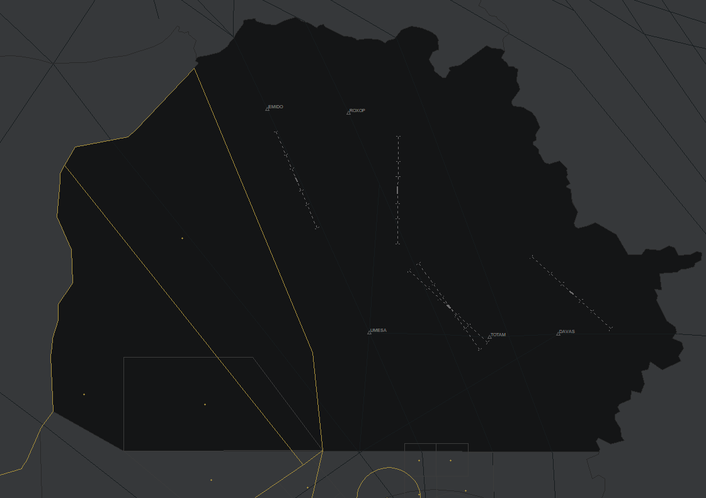

# 6. Kirkuk Intl Airport (ORKK)
## 6.1. Particulars

### 6.1.1. Aerodrome Description
Kirkuk International Airport is a smaller airport in Iraq that also serves as a military base. There is limited information on this airport, however civilian and military aircraft still operate here today.

### 6.1.2. Aerodrome Geographical Data

| **Data**         | **Value**             |
|------------------|-----------------------|
| ARP Coordinates  | N35°28.4' E44°20.8'   |
| Elevation at ARP  | 1061 feet   |
| Magnetic Variation  | 4° East   |

### 6.1.3. Radio Navigation & Landing Aids

| **Type**    | **Ident** | **Name** | **Frequency** | **Remarks**   |
|-------------|-----------|----------|----------------|----------------|
| DVOR/DME    | RER       | ERBIL    | 116.300 MHz    |                |
| ILS/DME 18  | IREA      |          | 109.100 MHz    | ILS CAT II     |
| ILS/DME 36  | IREB      |          | 109.700 MHz    | ILS CAT I      |

### 6.1.4. Runways

| **Runway** | **Runway Dimension** | **MAG BRG**     | **Threshold Elevation** |
|------------|----------------------|------------------|--------------------------|
| 13         | 2900 x 45 m          | 129°             | 1033 feet                |
| 31         | 2900 x 45 m          | 309°             | 1059 feet                |
| 14         | 2601 x 49 m          | 141°             | 1050 feet                |
| 32         | 2601 x 49 m          | 321°             | 1061 feet                |

## 6.2. General Aerodrome procedures
Kirkuk Airport was previously closed. There is extremely limited information on the airport as the AIP is also very vague on details about this airport. It does not have any published approach procedures and only seems to have an aerodrome chart and a visual approach chart. Thus, it can be assumed that only visual approaches are in effect at this airport. Runway 31 seems to be the preferential runway, with runway 13 being the alternative runway. All departures are assigned an IFR clearance with an omni-directional departure.

Kirkuk aerodrome has an SMC position (ORKK_GND) and an ADC position (ORKK_TWR). As is the procedure for all IFR departures in Iraq, ADC (ORKK_TWR) needs to get a release for departure from ORKK_APP, in addition to departure instructions for the heading and initial climb to maintain after departure.

## 6.3. TMA Procedures
The TMA position for Kirkuk airport is ORKK_APP and controls the Kirkuk TMA, located on the north side of Iraq. As with all approach positions, its radio-telephony callsign is “Baghdad Approach'' and controls traffic in the Kirkuk TMA from 1,500ft to FL235. Kirkuk TMA borders the Damascus (OSTT), Ankara (LTAA) and Tehran (OIIX) FIRs. IFR departures from Kirkuk need to be radar-vectored to their first fix of departure. Importantly, in addition to Kirkuk, ORKK_APP also controls traffic departing and arriving Erbil (ORER), Mosul (ORBM) and Sulaimaniyah (ORSM) on a top-down basis, if the local ADC stations are offline. Kirkuk airport itself does not have any published approach procedures. As such, the appropriate visual approach shall be assigned for aircraft landing at Kirkuk. Caution must be exercised in regards to terrain to the east of Kirkuk airport.

<figure markdown="span">
  { width=500}
  <figcaption>Kirkuk TMA and airspace controlled by ORKK_APP on VATSIM.</figcaption>
</figure>