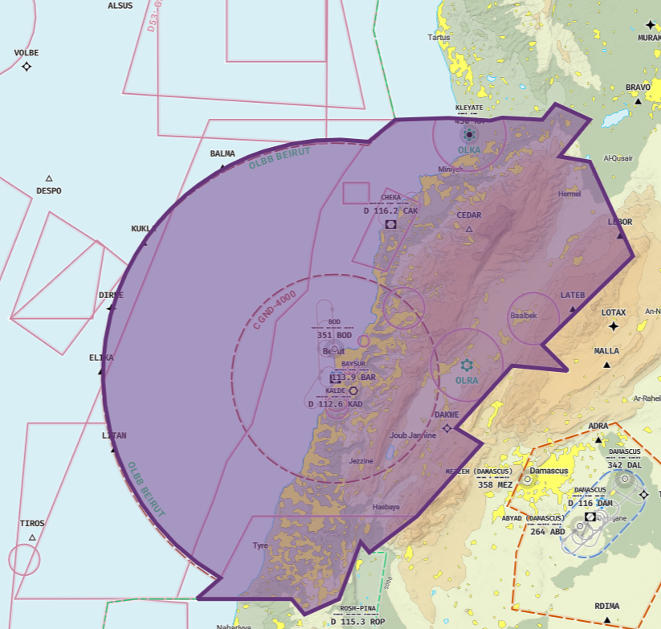
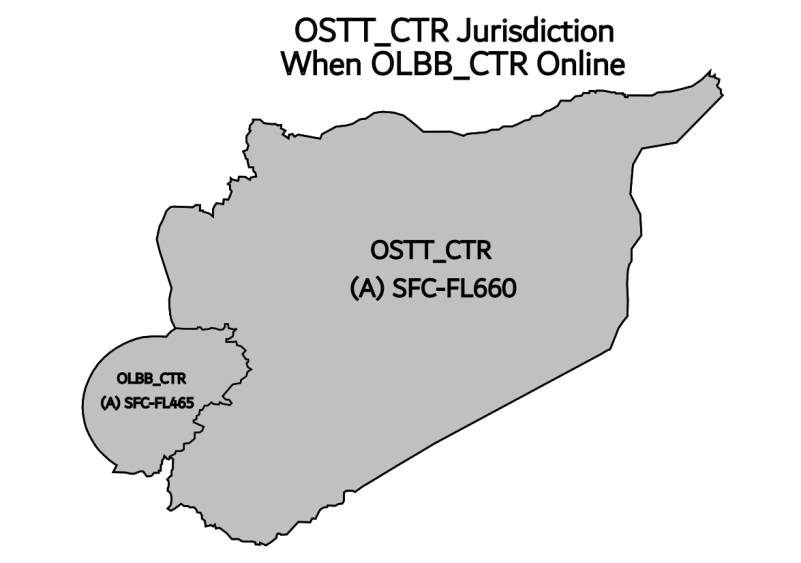
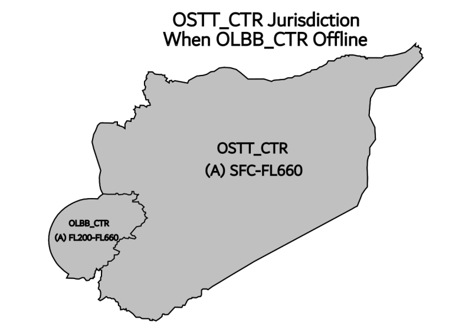

# 3. Beirut Tower

## 3.1 General Provisions
Beirut Tower is responsible for handling all traffic on Beirut’s runways and within the aerodrome traffic zone. Beirut Tower issues take-off and landing clearances, manages aircrafts remaining in the circuit and provides them with traffic information, ensures sequencing and separation of arrival traffic and traffic within the ATZ (Air Traffic Zone).

## 3.2 Runway Configurations
In Beirut, we operate with two standard runway configurations. The preferred configuration involves using runway 21 for departures, runway 16 for arrivals, and runway 17 for VFR operations, which may occasionally be used for IFR departures and arrivals as well. The second configuration uses runway 34 for departures, runway 03 for arrivals, and runway 35 for VFR operations, and it can also be utilized for IFR departures when necessary.

## 3.3 Departure Procedures

### 3.3.1 Line up clearances
Conditional line up instructions shall include the traffic that the aircraft is to follow, as well as the word “behind” at the beginning and end of the transmission. It is recommended to only have a maximum of two conditional line up clearances active at one i.e., one aircraft lining up behind a departure, and another aircraft lining up behind them.

!!! example
    **Controller**: “MEA204, BEHIND THE DEPARTING CEDARJET A320, VIA HOTEL, LINE UP AND WAIT RUNWAY 21
BEHIND.”

If aircraft have not yet reached the holding point where they are expected to line up at, ATC shall
reiterate the cleared holding point.

!!! example
    **Controller**: “MEA204, VIA HOTEL, LINE UP AND WAIT RUNWAY 21.”

### 3.3.2 Take-off Clearances
Aircraft shall be cleared for take-off once adequate separation exists as provided in Sections…. And the runway is clear of obstructing traffic or hazards.

!!! example "Example 1"
    **Controller**: “MEA201, WINDS 210 DEGREES AT 6 KNOTS, RUNWAY 21 CLEARED FOR TAKEOFF.”

If the aircraft is on radar vectors, the tower controller must pass the initial heading with the take-off clearance.

!!! example "Example 2"
    **Controller**: “MEA203, TURN RIGHT HEADING 220 DEGREES AFTER DEPARTURE, WINDS 210 DEGREES AT 6 KNOTS, RUNWAY 21 CLEARED FOR TAKEOFF.”

The aircraft may be handed off to the next controller after reaching 1,000 to 1,500 FT during departure.

For VFR circuit aircrafts, the circuit direction must be issued with the take-off clearance.

<!-- In the SOP it is example 4, example 3 is unavailable in the document-->
!!! example "Example 3" 
    **Controller**: “OD-BWE, FLY RIGHT HAND CIRCUITS, WIND 220 DEGREES AT 6 KNOTS, RUNWAY 17, CLEARED FOR TAKEOFF.”

### 3.3.3 Departure Wake Turbulence Separation Minimums
All departing aircrafts shall be timely separated in accordance with the standard ICAO separation for different wake turbulence categories of aircrafts.

A proceeding aircraft is the leading aircraft, while a succeeding aircraft is the tailing aircraft.

| Preceding Category | Succeeding Category | Separation (Minutes) |
|:------------------:|:-------------------:|:---------------------:|
| Jumbo              | Heavy               | 2                     |
| Jumbo              | Medium              | 3                     |
| Jumbo              | Light               | 3                     |
| Heavy              | Medium              | 2                     |
| Heavy              | Light               | 2                     |
| Medium             | Light               | 2                     |

* Scenarios not listed in the table above do not require any separation.
* All aircrafts departing on the same SID require a separation of 2 minutes.
* In scenarios where no separation is required, the succeeding aircraft must wait for the proceeding aircraft to cross the end threshold of the runway before being cleared for take-off.

The wake turbulence separation minimums apply when the conditions in the recent figure are met, and under the following circumstances:

* Two aircrafts departing from the same runway and same intersection.
* Two aircrafts departing from 2 different intersecting runways.
* Two aircrafts departing from 2 different runways but with intersecting flight paths after departure with less than 1,000 FT vertical separation.
* Departure from parallel runways that are separated by less than 760 meters.
* Departure from parallel runways that are separated by more than 760 meters, but the flight paths with intersect after departure at the same altitude.

When an aircraft is departing from an intersection following an aircraft that has departed from the full-length of the runway, the figure below applies.

| Preceding from Full-Length Category | Succeeding from Intersection Category | Separation (Minutes) |
|:-----------------------------------:|:-------------------------------------:|:---------------------:|
| Jumbo                               | Medium                                | 4                     |
| Jumbo                               | Light                                 | 4                     |
| Heavy                               | Medium                                | 3                     |
| Heavy                               | Light                                 | 3                     |
| Medium                              | Light                                 | 3                     |

In situations where there is both an arrival and a departure on two intersecting runways, it is imperative that the departing aircraft should never be cleared for take-off if the arrival aircraft on the intersecting runway is within a distance of less than 4 nautical miles from the final approach. This ensures safety and adequate separation between the two aircraft, especially in a case of a go around executed by the arrival when the departure is airborne.

### 3.3.4 Stopping a departure
Aircraft that have commenced their take-off roll may be instructed to stop immediately to avert a
collision due to a runway incursion or any other dangerous situation.
It must be noted though, that the instruction to stop must be given early enough such that the
aircraft does not reach its decision speed. Therefore, aerodrome controllers must be vigilant and
remain aware of the location of traffic and all times as well as runway incursion hotspots.

!!! example
    **Controller**: “MEA575, STOP IMMEDIATELY, I SAY AGAIN STOP IMMEDIATELY, TRUCK ENTERING THE
RUNWAY.”

For aircraft that have been given a take-off clearance, but have not yet started the roll, they shall be instructed to hold position and the take-off clearance must be cancelled along with the reason for
cancellation.

!!! example
    **Controller**: “MEA575, HOLD POSITION, CANCEL TAKE-OFF, I SAY AGAIN CANCEL TAKE-OFF, AIRCRAFT
ENTERING THE RUNWAY, ACKNOWLEDGE.”

## 3.4 Arrival Procedures

### 3.4.1 Landing Clearance
Aircrafts may be cleared for the following operations:

* Full Stop Landing
* Touch and Go
* Low Pass
* Stop and Go

Any clearance may only be issued if the runway is fully clear of any traffic or hazards, and the aircraft is first in the arrival sequence.

For aircrafts performing a full stop landing, a standard cleared to land phrase may be issued.

!!! example "Example 1" 
    **Controller**: “MEA313, WINDS 210 DEGREES AT 6 KNOTS, RUNWAY 16, CLEARED TO LAND.”

If the controller wishes that the aircraft vacates at a specific exit point upon landing, the instruction may be passed with the landing clearance.

!!! example "Example 2" 
    **Controller**: “MEA313, PLAN TO VACATE VIA NOVEMBER, WINDS 210 DEGREES AT 6 KNOTS, RUNWAY 16, CLEARED TO LAND.”

For aircraft engaged in VFR circuit operations, the choice of clearance is typically determined by the pilot's intentions.

!!! example "Example 3 and 4" 
    !!! example ""
        **Controller**: “OD-BWE, WINDS 210 DEGREES AT 6 KNOTS, RUNWAY 17, CLEARED FOR TOUCH AND GO.”

    !!! example ""
        **Controller**: EXAMPLE 4: “OD-BWE, WINDS 210 DEGREES AT 6 KNOTS, RUNWAY 17, CLEARED FOR LOW PASS.”

### 3.4.2 Arrival Wake Turbulence Separation Minimums
While the radar controllers are responsible for separating arriving aircraft, the tower controller shall still ensure that minimum separation is maintained until the preceding aircraft crosses the runway
threshold.

The ICAO defines standard separation distances between different wake categories of aircrafts to ensure safe landings and avoid wake turbulence.

| Preceding Arrival | Succeeding Arrival | Separation (Nautical Miles) |
|:------------------|:-------------------|:----------------------------:|
| Jumbo             | Heavy              | 5                            |
| Jumbo             | Medium             | 6                            |
| Jumbo             | Light              | 7                            |
| Heavy             | Heavy              | 4                            |
| Heavy             | Medium             | 5                            |
| Heavy             | Light              | 6                            |
| Medium            | Light              | 4                            |

* The minimum safe separation distance between all aircrafts is 3 nautical miles, a go-around must be executed if the separation is lost.
* If the wake turbulence separation is lost, the landing clearance may still be issued but with a “CAUTION WAKE TURBULENCE” at the end of the clearance.

!!! example
    **Controller**: “MEA123, WINDS 220 DEGREES AT 6 KNOTS, RUNWAY 16, CLEARED TO LAND, CAUTION WAKE TURBULENCE.”

## 3.5 Separation Techniques

### 3.5.1 Speed Control
If it is apparent that minimum separation may not exist, tower may use a tactical reduction in aircraft speed.

!!! example "Example 1" 
    **Controller**: “MEA215, REDUCE TO FINAL APPROACH SPEED.”

The tower controller may not control the speed of the aircraft after 4 nautical miles final of the runway.

### 3.5.2 Orbits
For sequencing VFR aircrafts and according to the airspace classification, tower may use orbit instructions to re-sequence aircrafts in a case of loss of separation.

!!! example "Example 1" 
    **Controller**: “OD-BWE, MAKE A RIGHT ORBIT ABOVE BEIRUT NDB (BOD) FOR SEQUENCING.”

### 3.5.3 Visual Separation
Aircraft may be instructed to maintain own separation visually, if speed control alone will not resolve the conflict. If no other solutions are practical, the succeeding aircraft shall be instructed to go around.

For VFR aircrafts and according to airspace classification, visual separation is the main separation technique used for sequencing aircraft.

!!! example "Example 1" 
    **Controller**: “OD-BWE, TRAFFIC IS A CESSNA 172, 12 O’CLOCK, AT 1, 500 FT, REPORT IN SIGHT.”

If the pilot reports that the traffic is in sight, the tower controller instructs the aircraft to maintain visual separation with the traffic and may instruct the pilot to follow the traffic with a sequence number.

!!! example "Example 2" 
    **Controller**: “OD-BWE, ROGER, MAINTAIN VISUAL SEPARATION, FOLLOW THE TRAFFIC, NUMBER 2.”

If visual contact is not reported by the pilot, then the tower must handle the responsibility of separation.

Based on airspace classification, if the pilot is failing to maintain visual separation, the tower must separate the aircrafts to avoid collision.

When requesting from a pilot to report an aircraft in sight, the aircraft must be within a reasonable field of view of the pilot. The pilot cannot look back and has no mirrors to see who is behind him

### 3.5.4 Circuit Leg Instructions
Tower may use these instructions to have more control over the traffic in the circuit, especially those who are unable to maintain visual separation with other aircrafts. These instructions include:

* Extend downwind
* Extend upwind
* Turn base
* Turn crosswind

!!! example "Example 1" 
    **Controller**: “OD-BWE, EXTEND DOWNWIND.”

Once the pilot is instructed to extend his downwind, the downwind will remain extended until instructed to turn base.

## 3.6 Go Around / Missed Approach Procedures
If no adequate separation exists, the aircraft must execute a go around. Each runway in Beirut has a standard go around procedure the aircraft must follow.

| Runway | Procedure                                                                 |
|:-------|:--------------------------------------------------------------------------|
| 16     | Turn right and track radial 250 outbound KAD climbing 2,000 FT           |
| 17     | Turn right heading 225 degrees climbing 2,000 FT                         |
| 21     | Turn right heading 230 degrees climbing 2,000 FT                         |
| 03     | Turn left and track radial 315 outbound KAD climbing 2,000 FT and maintaining 230 KT |

## 3.7 Airspace Classifications
The tower controller must utilize the separation techniques mentioned earlier based on the classification of the airspace. Each class of airspace contains rules placed by the ICAO on how air traffic service must be provided.

| Classification | Flight Rules Permitted | ATC Separation                                                                                 |
|:--------------:|:-----------------------|:-----------------------------------------------------------------------------------------------|
| B              | IFR and VFR            | ATC assumes full responsibility of separation between all flight types.                        |
| C              | IFR and VFR            | ATC disclaims responsibility of separation between VFR flights. Traffic information is provided between them. |
| D              | IFR and VFR            | ATC assumes full responsibility of separation between IFR flights ONLY. Other flights receive traffic information. |
| A              | IFR                   | ATC takes full responsibility of separation between IFR flights.                                |
| G              | IFR and VFR            | Uncontrolled                                                                                   |

!!! example "TRAFFIC INFORMATION EXAMPLE 1" 
    **Controller**: “OD-BWE, TRAFFIC IS CESSNA 172 AT 12 O’CLOCK, 1,200 FT, REPORT IN SIGHT.”

Traffic information is only provided when the aircraft CAN SEE the other aircraft. It is illogical to provide traffic information to the aircraft ahead about an aircraft behind. In this case, the traffic information is given to the aircraft behind about the aircraft ahead.

During separation and VFR sequencing, the priority always goes to the IFR flight. It is illogical to delay a scheduled IFR flight for the purpose of VFR operations except in emergency cases.

In VFR operations, traffic information is the friend. It can be passed anytime where applicable, it can be provided in take-off clearances, and in touch and go clearances.

Restricted, Prohibited, and Danger Airspaces

| Identifier | Name                 | Vertical Designation              | Type        |
|:----------:|:---------------------|:----------------------------------|:-----------:|
| P1         | SAIDA/TYR            | Unlimited                         | Prohibited  |
| R4         | RAYAK                | 1500 ft AGL to 10,000 ft MSL      | Restricted  |
| R5         | KLEYATE              | 1500 ft AGL to 10,000 ft MSL      | Restricted  |
| R6         | PRESIDENTIAL PALACE  | GND to 5000 ft MSL                | Restricted  |
| R7         | MINISTRY OF DEFENSE  | GND to 5000 ft MSL                | Restricted  |
| R8         | AMERICAN EMBASSY     | GND to 5000 ft MSL                | Restricted  |
| R12        | HAMAT                | GND to 5,000 ft MSL               | Restricted  |
| D2         | IAAT                 | GND to 14,000 ft MSL              | Danger      |
| D3         | WATA AL-JAWZ         | GND to 14,000 ft MSL              | Danger      |
| D9         | NA'EME HILLS         | GND to 10,000 ft MSL              | Danger      |
| D10        | DAMOUR HILLS         | GND to 10,000 ft MSL              | Danger      |
| D11        | ANFE                 | GND to 9,000 ft MSL               | Danger      |

## 3.8 Radar Antennas
Lebanon's air traffic management employs a network of three radar systems to acquire and monitor air traffic, extending their coverage as far as Turkey.

The initial two radars are situated locally, while the third radar is positioned in Larnaca. Data and traffic information gleaned from Larnaca's radar are seamlessly integrated with Beirut's radar systems, extending their surveillance reach into European airspace.

| Name          | Modes    | Primary Range | Secondary Range | Elevation | Coordinates |
|:--------------|:---------|:--------------|:----------------|:----------|:------------|
| Beirut Radar  | PSR/SSR  | 35 NM         | 256 NM          | 85 ft     |             |
| Baysur Radar  |          |               |                 |           |             |
| Larnaca Radar | PSR/SSR  | 256 NM        | 256 NM          | 11 ft     |             |

## 3.9 TMA Procedures

{ width="500"}

OLBA_APP (Beirut Approach) is responsible for providing radar services within the Lebanon FIR (OLBB) from the surface up to FL195, including all controlled airports and airspace sectors within this volume. This position is operated in a top-down capacity when no lower positions (such as tower or ground) are online.

### 3.9.1 Airspace Jurisdiction
Vertical Limits: SFC – FL195

Lateral Limits: Entire OLBB FIR

Primary Controlled Airports:
OLBA – Beirut Rafic Hariri International Airport

Other smaller airfields within OLBB FIR (VFR only if applicable)

### 3.9.2 Coordination between surrounding sectors
OLBA_APP will only accept aircraft in under the following conditions:

* Traffic at or below FL195
* or Descending FL195
* OLB* Arrival
* Overflight that does not climb above FL195

### 3.9.3 Standard Instrument Arrivals

| Runway | 17 | 21 | 34 | 35 | 03 | 16 |
|:------:|:--|:--|:--|:--|:--|:--|
| STAR | BALMA1A BYBLO1A ELIKA1A KALDE1A KUKLA1A | N/A | N/A | N/A | BALMA1N CHEKA1N ELIKA1N KALDE1N KUKLA1N | BALMA2F CHEKA2F ELIKA2F KALDE2F KUKLA2F |
| RNAV STAR | BALMA2A ELIKA2A KUKLA2A LEBOR2A | BALMA1R ELIKA1R KUKLA1R LEBOR1R | N/A | N/A | BALMA2N ELIKA2N KUKLA2N LEBOR2N | BALMA1X ELIKA1X KUKLA1X LEBOR1X |

Runways 34 and 35 are never used for arrivals. All arrivals must be kept on the STAR to the extent possible without radar vectors, if radar vectors are to be given, the reason must be stated and for how long.

### 3.9.4 Approach Procedures

| Runway | 17 | 21 | 34 | 35 | 03 | 16 |
|:------:|:--|:--|:--|:--|:--|:--|
| Procedure | ILS RNP VOR BOD NDB | RNP | N/A | N/A | ILS RNP VOR | ILS RNP VOR |

### 3.9.5 Missed Approach Procedures

| Runway | 17 | 21 | 34 | 35 | 03 | 16 |
|:------:|:--|:--|:--|:--|:--|:--|
| Procedure | RT HDG 225 2000ft. | RT HDG 230 2000ft. | N/A | N/A | LT HDG 315 2000ft. | RT HDG 250 2000ft. |

### 3.9.6 Holding Procedures

| Name   | Turn Direction | Inbound Course | Max Speed | Arrival Runway |
|:------:|:--------------:|:--------------:|:---------:|:--------------:|
| ZALKA  | Right          | 162            | 230 KT    | 16             |
| BYBLO  | Right          | 172            | 230 KT    | 17             |
| BA417  | Right          | 172            | 230 KT    | 21             |
| RAMLA  | Left           | 028            | 230 KT    | 03             |

### 3.9.7 IFR and VFR Clearances
For all departing IFR flights from Beirut, it is imperative to possess an approved flight plan inclusive of a valid route and appropriate flight level aligned with the intended direction of travel. Clearance requests via radio communication are mandatory.

Similarly, VFR flights departing from Beirut necessitate a valid flight plan specifying an approved route, except for VFR circuit operations. VFR flights are exempt from requesting radio clearance. Pilots may promptly request engine startup, and approval will be granted contingent on the conformity of their filed flight plan.

The Lebanese FIR does not use the PDC and CPDLC system.

## 3.10 CTR Procedures
OLBA_CTR (Beirut Radar) is responsible for providing radar services within the Lebanon FIR (OLBB) from the surface up to FL465, including all controlled airports and airspace sectors within this volume. This position is operated in a top-down capacity when no lower positions
are online.

### 3.10.1 Overflights
Numerous aircraft overfly the Beirut FIR due to its location between Europe and the Middle East.
There a numerous entry and exit points within the OLBB FIR, any overflight must utilise on of the below entry/exit points:

Entry Points: BALMA, KUKLA, ELIKA, LITAN, LEBOR, LATEB.

Exit Points: BALMA, KUKLA, ELIKA, LITAN, LEBOR, LATEB.

Overflight routes should comply with the current AIRAC charts. Aircraft should be routed along established airways. Overflights should remain on airways for the entirety of their transit, unless deviation is coordinated with neighboring FIRs.

### 3.10.2 Airways
There are multiple airways within the Beirut FIR, Only some are omni directional. Note, there are no airways in and out of Israel.

| Airway   | Direction | Min Level |
|:--------:|:---------:|:---------:|
| N438     | Omni      | FL050     |
| G2       | Omni      | FL050     |
| R219     | Omni      | FL050     |
| B15      | Omni      | FL050     |
| R655     | Omni      | FL060[^1]    |
| UN438    | Omni      | FL195     |
| UG2      | Omni      | FL195     |
| UR219    | Omni      | FL195     |
| UB15     | Omni      | FL195     |
| UR655    | Omni      | FL195     |
| P/UP300  | Omni      | FL130     |
| N/UN310  | W to E    | FL130     |

[^1]: Eastbound min level FL060 until CAK VOR, then FL130.

<ol>

1. Eastbound min level FL060 until CAK VOR, then FL130.&nbsp;<a href="#fnref:1" title="Jump back to footnote 1 in the text">↩</a>

</ol>

### 3.10.3 APP/CTR - Internal LOA
When APP is online the following pre-agreed clearance limits are in place:

Arrivals routing through CEDAR will be cleared FL130 by CTR and will only be transferred when passing below FL190.

Departures routing through LEBOR will be cleared FL240[^2] alternatively departures routing through LATEB will be cleared FL290 by APP.

[^2]: Traffic arriving into damascus will be cleared to FL190 only.

<ol>

2. Traffic arriving into damascus will be cleared to FL190 only.&nbsp;<a href="#fnref:2" title="Jump back to footnote 2 in the text">↩</a>

</ol>

### 3.10.4 OSTT/OLBB Internal LOA
OSTT_CTR online/ OLBB_CTR offline:

!!! quote ""
    When OSTT_CTR is online, OLBB_CTR (OLBB_CTR Class A FL200-FL465) is covered by OSTT_CTR from FL200-FL660 when OLBB_CTR offline (OLBA_APP cover SFC-FL195)

OSTT online/ OLBB_CTR online:

!!! quote ""
    When OLBB_CTR is online, OSTT_CTR relinquishes the airspace (OLBB_CTR Class A FL200-FL465) back to OLBB_CTR. FL470-FL660 reverts to Class G

{width=360}
{width=360}
    

### 3.10.5 OSDI Arrivals/Departures
Arrivals into OSDI must leave OLBB via LATEB at FL190, upon transfer from OLBB radar services must be terminated.

Departing traffic from OSDI to leave the sector via Beirut must be FL210.

Higher can be given when coordinated so it doesn't interfere with arriving into OLBA (traffic landing beirut will be at LEBOR around FL230-250)